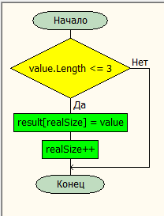

# Итоговая проверочная работа. Первая четверть

## Задача
Написать программу, которая из имеющегося массива целых чисел формирует массив из четных чисел. Первоначальный массив можно ввести с клавиатуры, либо сгенерировать случайным образом. При решении не рекомендуется пользоваться коллекциями, лучше обойтись исключительно массивами.

## Блок схема основного алгоритма


## Код основного алгоритма
```C#
using System;
 
string[] array =
{
    "hello",
    "2",
    "world",
    ":-)",
    "1234",
    "-2"
};
 
var result = new string[array.Length];
var realSize = 0;
foreach (var value in array)
{
    if (value.Length <= 3)
    {
        result[realSize] = value;
        realSize++;
    }
}
 
Console.WriteLine(string.Join(Environment.NewLine, result, 0, realSize));

```

